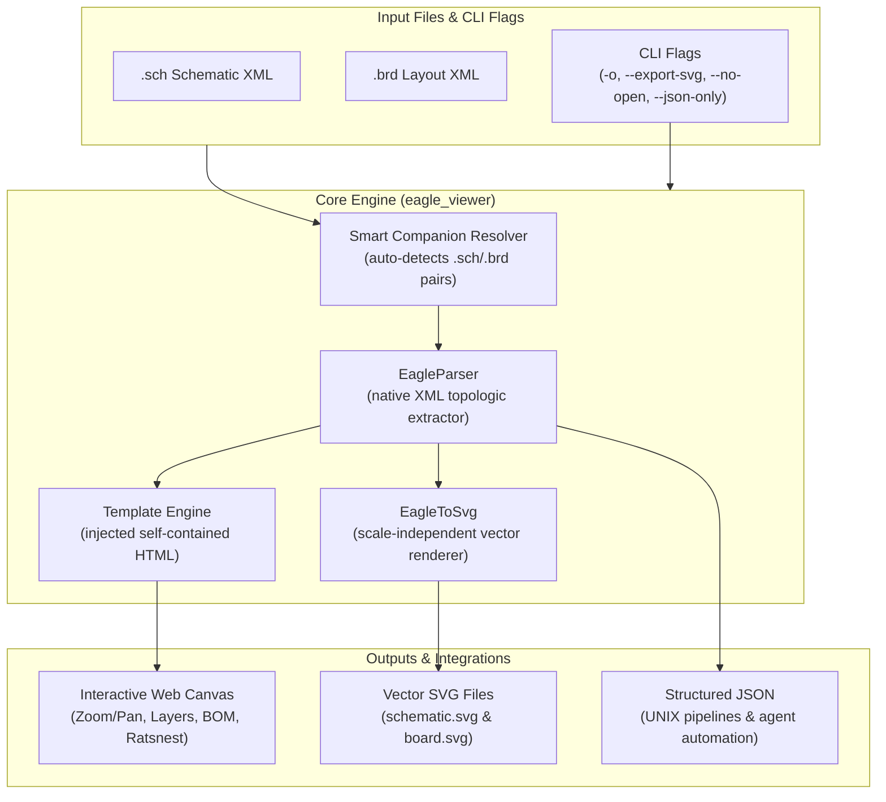

# EAGLE CAD Standalone Interactive Web & Vector Viewer (`eagle-viewer`)

[](https://opensource.org/licenses/MIT)
[](https://www.python.org/downloads/)
[](https://github.com/fbetancourt-dev/eagle-viewer)
[](https://github.com/fbetancourt-dev/eagle-cad-skill)

A standalone, zero-dependency Python CLI tool and interactive web visualizer for **Autodesk & CadSoft EAGLE CAD** schematic (`.sch`) and printed circuit board layout (`.brd`) XML files.

Designed to be executed directly as a first-class engineering CLI application (with full parameter customization) or orchestrated autonomously by AI coding agents via [eagle-cad-skill](https://github.com/fbetancourt-dev/eagle-cad-skill).

---

## 🏛️ Architecture & Pipeline



---

## ✨ Features

- **Interactive Canvas & SVG Web Viewer:** Real-time panning, infinite zooming, layer filtering (Top copper, Bottom copper, Silkscreen, Solder Pads, Vias, Dimension border), and ratsnest unrouted airwire display in any modern browser.
- **Smart Companion Auto-Discovery:** Pointing to `circuit.brd` automatically locates and loads `circuit.sch` in the same directory (and vice-versa).
- **Vector SVG Exporter:** Generates high-resolution, scale-independent vector SVGs of both schematic and board copper layers for documentation, reports, and artifact embedding.
- **Clean UNIX Pipeline Compatibility:** Output topology JSON directly to `stdout` (`--json-only`) with graceful broken pipe handling for tools like `jq`, `grep`, and headless CI automation.
- **Zero Heavy Web Dependencies:** Self-contained, single-file HTML generation without requiring Node.js, npm, Webpack, or external web runtimes.
- **Skill-Ready Architecture:** Clean separation of concerns allowing seamless use as a standalone command-line tool or as the visual engine for [eagle-cad-skill](https://github.com/fbetancourt-dev/eagle-cad-skill).

---

## 📥 Installation & Setup

### 1. Global User Binary (Recommended)
Link the executable script directly to your user PATH:
```bash
ln -sf $(pwd)/main.py ~/.local/bin/eagle-viewer
chmod +x ~/.local/bin/eagle-viewer
```

Verify the installation:
```bash
eagle-viewer --version
```

### 2. Pip Editable Mode
Install locally into your active Python environment:
```bash
pip install -e .
```

---

## 💻 CLI Reference

```bash
eagle-viewer [files ...] [options]
```

### Options

| Flag | Type | Description |
| :--- | :--- | :--- |
| `files` | `positional` | Path to `.sch` and/or `.brd` files, or circuit name without extension. |
| `--sch <path>` | `string` | Explicit path to EAGLE schematic XML file (`.sch`). |
| `--brd <path>` | `string` | Explicit path to EAGLE board XML file (`.brd`). |
| `-o, --output <path>` | `string` | Custom path for generated HTML viewer (default: `<name>_viewer.html`). |
| `--export-svg [dir]` | `string?` | Export schematic and PCB vector SVGs (optional target directory). |
| `--no-open` | `flag` | Generate viewer and assets without launching default web browser. |
| `--json-only` | `flag` | Print parsed circuit topology JSON to stdout and exit. |
| `--json [file]` | `string?` | Save parsed circuit topology JSON to a file (or stdout if `-`). |
| `--theme {dark,classic}` | `choice` | Default viewer theme (default: `dark`). |
| `-v, --version` | `flag` | Show program version. |
| `-h, --help` | `flag` | Show help and argument summary. |

---

## 🚀 Examples

### 1. Open Interactive Viewer for Schematic and PCB
```bash
eagle-viewer usb_c_charger.sch usb_c_charger.brd
```

### 2. Auto-discover Companion File
Passing only the board automatically finds and loads the matching schematic:
```bash
eagle-viewer usb_c_charger.brd
```

### 3. Headless SVG Export for CI / Documentation
```bash
eagle-viewer usb_c_charger.brd --export-svg ./svg_assets/ --no-open -o ./docs/index.html
```

### 4. Extract Circuit JSON for UNIX Pipelines
```bash
eagle-viewer usb_c_charger.brd --json-only | jq '.board.elements[] | {name: .name, value: .value}'
```

---

## 🔗 Related Projects

- **[`eagle-cad-skill`](https://github.com/fbetancourt-dev/eagle-cad-skill):** Autonomous AI agent skill providing ERC/DRC auditing, hybrid autorouting, BOM extraction, and programmatic editing for EAGLE CAD files.

---

## 📜 License

This project is licensed under the MIT License — see the [LICENSE](LICENSE) file for details.  
Created by **Francisco Betancourt** & **Antigravity (Sam)**.
